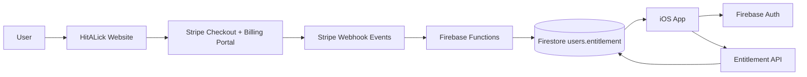

# HitALick Cursor Development Brief

## Vision
HitALick is an elite sports analytics intelligence platform with a web-first commercial model and an iOS companion experience.

- **Website (`hitalick.org`)** is the sole originator of subscriptions and revenue.
- **iOS app** is a signed-in subscriber viewer for analytics and insights.
- **Core value** is decision support through data context, not betting transactions.

## Apple Policy Guardrails (Non-Negotiable)
- No payment collection inside iOS.
- No in-app subscription purchase prompts or checkout surfaces.
- No betting placement flow, gambling wallet, chips, credits, or simulated wagering loops.
- Product language stays analytics-first: trends, performance context, projections, and insights.
- Entitlements are validated server-side before premium content unlock.

## Product Pillars
- **Player Panels**: profile, team/position context, form trends, and historical splits.
- **Team Panels**: roster-level and game-level aggregate analytics.
- **Multi-Chart Analytics**: trend line, game bar, comparison overlays, and filter controls.
- **Bruce Picks**:
  - Certain Plays
  - Plays I Like
  - premium rationale and context for subscribers
- **Filters and Sorting**: position, team, date range, home/away, metric class, performance momentum.

## Monetization and Access Model
- Stripe billing runs on web only.
- Supported tiers:
  - Bruce Picks Monthly: `$9.99`
  - Bruce Picks Annual: `$99`
  - Bruce Elite VIP: `$199/year`
- Promotions and codes handled in Stripe Checkout/Billing Portal.
- iOS only reads entitlement state and unlocks already-purchased content.

## System Architecture

## Subscription Entitlement Flow
1. User starts on `hitalick.org/pricing.html`.
2. Website calls `POST /api/billing/create-checkout-session` with `uid`, `email`, `tier`.
3. Stripe completes checkout and creates/updates subscription.
4. `stripeWebhook` processes Stripe lifecycle events.
5. Backend writes `users/{uid}.entitlement` to Firestore.
6. iOS login fetches entitlement and toggles premium access.

## Backend and API Surface
- `POST /api/billing/create-checkout-session`
- `POST /api/billing/customer-portal`
- `GET /api/billing/entitlements/:uid`
- `stripeWebhook` function:
  - `customer.subscription.created`
  - `customer.subscription.updated`
  - `customer.subscription.deleted`

## Elite UI Upgrade Scope
- Build modular panel cards with progressive disclosure (collapsed/expanded states).
- Add clear visual hierarchy for:
  - Trending players
  - Bruce Picks updates
  - Team momentum snapshots
- Add smooth chart interactions and lightweight transitions.
- Use modern sports-tech visual style with high contrast and clean readability.

## Asset and Data Standardization (Logos + Headshots)
- Team logos: normalize by league + team code, with fallback placeholders.
- Player headshots: canonical URL map and cached image loading.
- Validate all image links in backend ingestion to prevent broken assets in app/web.
- Add graceful UI fallback states for missing or delayed media.

## Website Originator Features
- Pricing and checkout at `hitalick.org`.
- Account management and Stripe customer portal access.
- Bruce Picks publishing workflow through backend-managed content.
- Subscriber update notifications (email/push strategy managed on backend).

## Environment Variables Required
- `STRIPE_SECRET_KEY`
- `STRIPE_WEBHOOK_SECRET`
- `STRIPE_PRICE_BRUCE_MONTHLY`
- `STRIPE_PRICE_BRUCE_ANNUAL`
- `STRIPE_PRICE_BRUCE_ELITE_VIP`
- `APP_SUCCESS_URL` (optional)
- `APP_CANCEL_URL` (optional)

## Deployment Targets
- Firebase Hosting for public website pages.
- Firebase Functions for API and webhook handling.
- Custom domain target: `hitalick.org`.
- SSL and DNS managed in Firebase Hosting custom domain setup.

## Current Compliance Notes Applied
- Web copy and app copy positioned as analytics-only.
- iOS splash language adjusted to remove direct betting language.
- iOS premium screen framed as companion access after web signup.

## Recommended Store and Legal Footer Copy
"HitALick provides informational sports analytics only. HitALick does not facilitate wagering, gambling transactions, or simulated betting. All decisions are user-directed."
